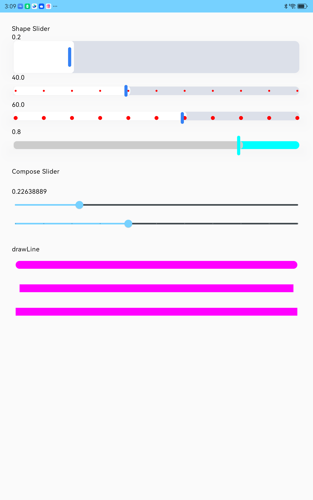

# ShapeSlider



```kotlin
fun ShapeSlider(
    value: Float,
    modifier: Modifier = Modifier,
    enabled: Boolean = true,
    valueRange: ClosedFloatingPointRange<Float> = 0f..1f,
    /*@IntRange(from = 0)*/
    steps: Int = 0,
    colors: AutraSliderColors,
    onValueChange: (Float) -> Unit,
    interactionSource: MutableInteractionSource = remember { MutableInteractionSource() },

    tickHeight: Dp,
    trackOffset: Dp = 0.dp,
    tickSize:Dp = 2.dp,

    modifierShapeTrack: Modifier = Modifier,
    modifierShapeActive: Modifier = Modifier,
    modifierThumb: Modifier = Modifier,
) 
```

> Compose Slider 的默认参数
>
>     value: Float,
>     modifier: Modifier = Modifier,
>     enabled: Boolean = true,
>     valueRange: ClosedFloatingPointRange<Float> = 0f..1f,
>     /*@IntRange(from = 0)*/
>     steps: Int = 0,
>     colors: AutraSliderColors,
>     onValueChange: (Float) -> Unit,
>     interactionSource: MutableInteractionSource = remember { MutableInteractionSource() },

>     1. tickHeight: Dp,                   tick 的高度，影响tick 在Track 垂直方向的偏移
>     2. trackOffset: Dp = 0.dp,           activie 的偏移量，参考图，active track 超出thumb 部分
>     3. tickSize:Dp = 2.dp,               tick 点的大小


> ```kotlin
> 1. modifierShapeTrack: Modifier = Modifier,      WholeTrack 的Modifier
> 2. modifierShapeActive: Modifier = Modifier,     ActiveTrack 的Modifier
> 3. modifierThumb: Modifier = Modifier,           Thumb Modiffier
> ```


最终效果

```kotlin
ShapeSlider(
    sliderPosition,
    Modifier,
    enabled = true,
    colors = colors,
    onValueChange = { sliderPosition = it
        Log.d("ShapeSlider", "ShapeSlider onValueChange $it")
    },
    tickHeight = 82.dp,
    trackOffset = 10.dp,
    tickSize = 5.dp,
    modifierShapeTrack = Modifier
        .shadow(
            elevation = 24.dp,
            spotColor = Color(0x291E293B),
            ambientColor = Color(0x291E293B)
        )
        .shadow(
            elevation = 2.dp,
            spotColor = Color(0x0A1E293B),
            ambientColor = Color(0x0A1E293B)
        )
        .height(82.dp)
        .background(
            color = colors.trackColor(true, false).value,
            shape = RoundedCornerShape(size = 12.dp)
        ),
    modifierShapeActive = Modifier
        .shadow(
            elevation = 2.dp,
            spotColor = Color(0x1F1E293B),
            ambientColor = Color(0x1F1E293B)
        )
        .height(82.dp)
        .background(
            color = colors.trackColor(true, true).value,
            shape = RoundedCornerShape(size = 8.dp)
        ),
    modifierThumb = Modifier
        .size(DpSize(8.dp, 50.dp))
        .shadow(
            elevation = 2.dp,
            spotColor = Color(0x1F1E293B),
            ambientColor = Color(0x1F1E293B)
        )
        .width(8.dp)
        .height(50.dp)
        .background(
            color = colors.thumbColor(true).value,
            shape = RoundedCornerShape(size = 8.dp)
        )
)
```
